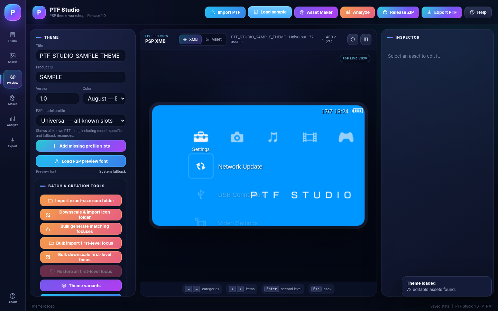
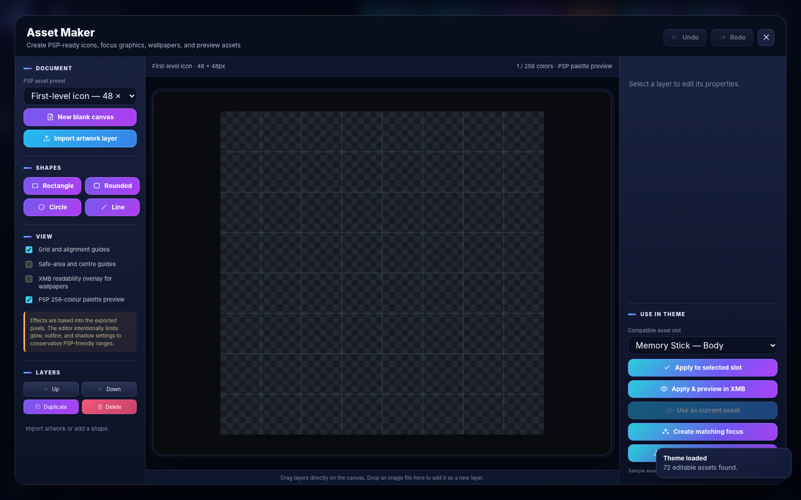

# PTF Studio 1.0

PTF Studio is a portable visual maker, editor, live XMB viewer, and exporter for standard Sony PSP `.ptf` themes. It runs locally in a modern browser on macOS and Windows and is intended for the PSP modding community.

## Screenshots

## Launch

### macOS

Double-click `PTF Studio.command`, or right-click `PTF Studio.app` and choose **Open**.

### Windows

Double-click `PTF Studio.bat`.

You may also open `index.html` directly in a current Safari, Chrome, Edge, or Firefox browser.

## Core capabilities

- Import and edit existing PSP PTF themes.
- Support modern Deflate/stored resources and legacy RLZ/LZR-compressed themes.
- Rebuild and export PSP-compatible `.ptf` files with post-export verification.
- Edit Title, Product ID, Version, and fixed/monthly theme colour metadata.
- Preview wallpapers, category icons, first-level icons, second-level icons, focus graphics, status display, and XMB navigation.
- Replace assets individually, through bulk-folder tools, or directly from the live viewer.
- Use separate **Import** and **Downscale & Import** workflows.
- Downscale oversized artwork with alpha-safe bicubic smooth filtering while preserving transparent borders and the complete source canvas.
- Convert exported artwork to PSP-sized indexed GIM assets with a maximum 256-colour palette.
- Export individual assets as PNG.
- Generate focus artwork for one selected icon or in bulk from all matching normal icons.
- Analyze dimensions, palette use, transparency, compression, and estimated final PTF size.
- Create theme variants and release ZIP packages.
- Use PSP-1000, PSP-2000, PSP-3000, PSP Go, PSP Street, or Universal model profiles.

## Asset Maker

The integrated Asset Maker provides PSP-native presets for:

| Asset | Canvas |
|---|---:|
| Wallpaper | 480 × 272 |
| Preview image | 300 × 170 |
| Preview icon | 16 × 16 |
| Category icon | 64 × 48 |
| First-level icon | 48 × 48 |
| First-level focus | 64 × 64 |
| Second-level icon | 32 × 32 |
| Second-level focus | 48 × 48 |

It includes layers, imported artwork, basic shapes, transforms, opacity, colour adjustment, simple gradients, conservative PSP-safe outline/shadow/glow effects, undo/redo, palette preview, direct asset assignment, focus generation, and PNG export.

## New in 1.0

### Release interface

- Completely redesigned dark navy interface with cyan-to-violet accents.
- New vertical workspace rail for Theme, Assets, Preview, Asset Maker, Analysis, Export, and About.
- Refined three-panel layout with clearer hierarchy and responsive behaviour.
- Improved cards, inputs, asset rows, dialogs, notifications, scrollbars, and button styling.
- Larger framed live-view presentation and improved Asset Maker workspace styling.

### More accurate live XMB viewer

- Coordinates recalibrated from direct 480 × 272 PSP screenshots.
- Refined category spacing, selected-category anchoring, labels, and inactive opacity.
- First-level neighbouring icons and labels now remain visible with PSP-like dimming.
- Previous rows move into the correct lane above the category row rather than overlapping it.
- Storage entries use the PSP-style two-line label, divider, and free-space presentation.
- Icon and focus canvases are drawn without unnecessary interpolation at exact PSP scaling.
- Softer text shadow, corrected status spacing, and updated Online Instruction Manuals label.
- Existing focus pulse, second-level submenu shift, PSP Go layout, battery, date, and time behaviour remain intact.

## Supported model profiles

- PSP-1000
- PSP-2000
- PSP-3000
- PSP Go
- PSP Street / E1000
- Universal — all known slots

The PSP Go profile includes System Storage, Saved Data Utility — System Storage, Resume Game, and separate Memory Stick entries. UMD-related entries remain hidden for PSP Go.

## Notes and limitations

- PTF Studio edits standard PTF themes only. It does not edit CTF, PRX, RCO, firmware modules, system fonts, wave animations, or firmware-level XMB coordinates.
- The live viewer is a close visual recreation, not a PSP emulator. Firmware-rendered content such as actual media names and free-space values is represented with preview text.
- The PSP system font is not bundled. A local OTF/TTF font may be loaded for previewing.
- The planned distributable sample-icon library is not included in this release.
- Test exported themes from `/PSP/THEME/` on the intended PSP model before public distribution.

## Credits

Created by Blue with the use and assistance of ChatGPT. See `CREDITS.md`.

### PSP-safe focus generation
Generated first- and second-level focus assets use fixed Sony-compatible canvases, white alpha-only halos, a maximum 64-entry palette, GIM round-trip validation and a 768 KB theme-size preflight.
